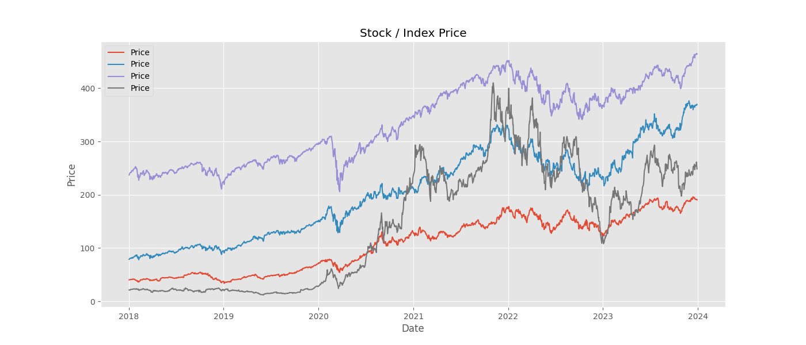
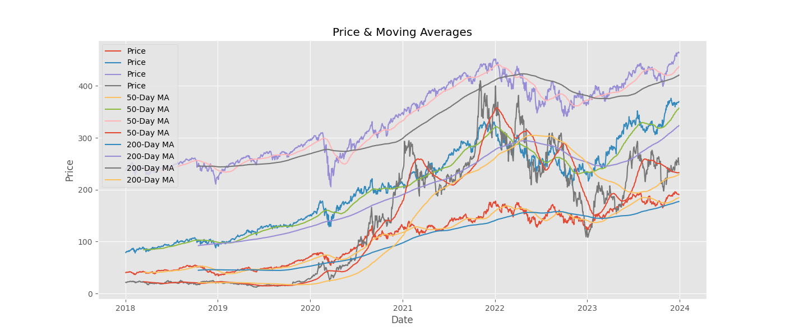
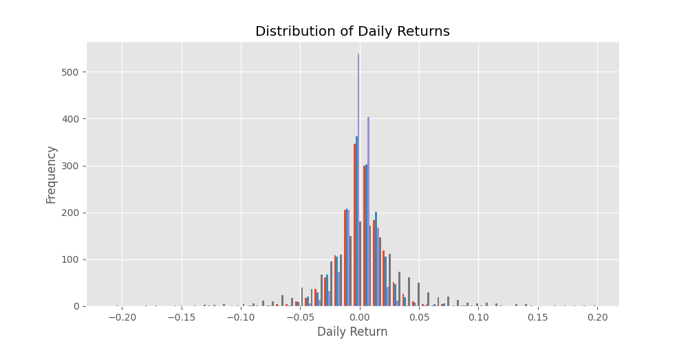
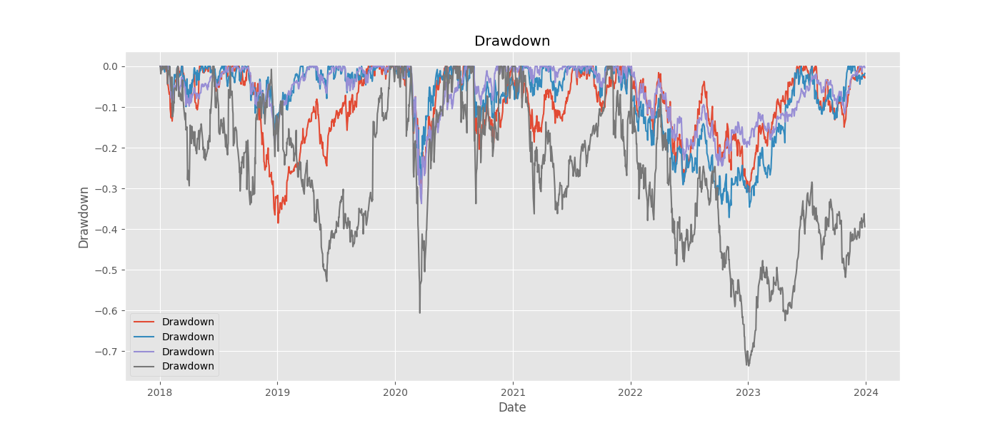

# Financial Analysis Dashboard

##  Project Objective
This project analyzes stock price data using Python.
It calculates financial metrics and visualizes risk and return.

---

##  Data Source
Stock price data uploaded in CSV format.

---

##  Tools Used
- Python
- Pandas
- Matplotlib
- Google Colab

---

##  Key Metrics Calculated
- Daily Returns
- Annualized Volatility
- Moving Averages (50-day & 200-day)
- Sharpe Ratio
- Rolling Volatility
- Cumulative Returns
- Maximum Drawdown
- Risk vs Return

---

##  Visualizations

### Price Trend

### Moving Averages

### Return Distribution

### Risk vs Return

### Drawdown

---

##  Conclusion
This dashboard helps understand stock performance,
risk measurement, and investment analysis.
